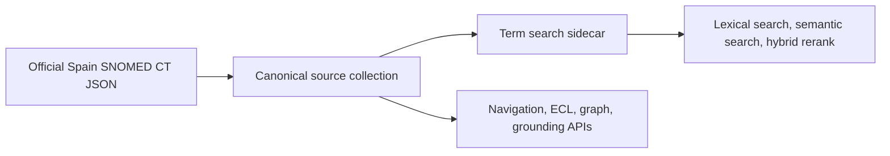
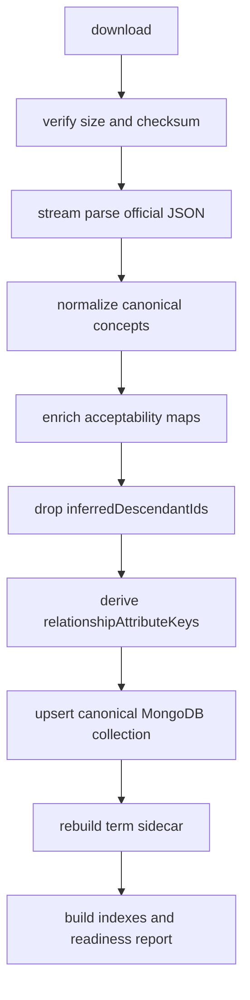

# Official SNOMED CT Spain JSON Download And Diff

Date of analysis: 2026-07-10

This note captures the first pass over the official Spain SNOMED CT JSON supplied by the Ministerio/CNR and compares it with the current MongoDB serving model used by the demo. It is intentionally scoped to download, inspection, and model implications. The future Python library should automate these steps, but this pass does not implement ingestion.

## Download

The access guide describes a plain FTP endpoint, not SFTP:

- Host: `somsns.es`
- Protocol: FTP
- Port: `21`
- Encryption: none
- Remote file: `emdicion_20260601.json`

Credentials should be supplied through environment variables or a secrets manager. Do not commit them.

Example one-off download:

```bash
export SNOMED_FTP_USER="..."
export SNOMED_FTP_PASSWORD="..."
mkdir -p tmp/official-snomed-json

python3 - <<'PY'
import ftplib
import os
from pathlib import Path

host = "somsns.es"
remote = "emdicion_20260601.json"
target = Path("tmp/official-snomed-json") / remote

with ftplib.FTP(host, timeout=60) as ftp:
    ftp.login(os.environ["SNOMED_FTP_USER"], os.environ["SNOMED_FTP_PASSWORD"])
    target.parent.mkdir(parents=True, exist_ok=True)
    with target.open("wb") as out:
        ftp.retrbinary(f"RETR {remote}", out.write, blocksize=1024 * 1024)

print(target, target.stat().st_size)
PY
```

Downloaded file:

- Local path: `tmp/official-snomed-json/emdicion_20260601.json`
- Size: `3,249,049,694` bytes
- SHA-256: `ec8838269640ca2208775f5e9f34a2e574d55be59e02463593ca1df7b086d791`

## Official JSON Shape

The file is a single top-level JSON array with one object per concept. The raw shape matches the canonical source model closely:

- `conceptId`, `effectiveTime`, `active`, `moduleId`, `definitionStatusId`
- `inferredAttributes`, `inferredConcreteAttributes`
- `memberOfRefsetIds`
- `relationships`, `concreteRelationships`
- `descriptions`
- `inferredParentIds`, `inferredAncestorIds`, `inferredChildIds`, `inferredDescendantIds`

Important raw-source quirks:

- Hierarchy arrays such as `inferredParentIds` and `inferredAncestorIds` contain numbers, not strings.
- Relationship `active` values are string flags in some records.
- `acceptabilityMap` is present inside descriptions, but it is empty throughout this JSON.
- `inferredDescendantIds` is still present in the official file.

Official file summary:

| Metric | Value |
| --- | ---: |
| Concepts | 554,809 |
| Active concepts | 402,659 |
| Inactive concepts | 152,150 |
| Max `effectiveTime` | 20260601 |
| Descriptions | 3,251,900 |
| Description languages | `en`: 1,737,690; `es`: 1,514,210 |
| Concepts with non-empty ancestors | 402,379 |
| Concepts with non-empty children | 142,504 |
| Concepts with non-empty descendants | 142,504 |
| Max descendant array length | 397,847 |

Top modules:

| Module ID | Concepts |
| --- | ---: |
| `900000000000207008` | 528,706 |
| `90000011000140108` | 16,524 |
| `900000001000122104` | 7,636 |
| `900000000000012004` | 1,941 |
| `450829007` | 2 |

## Current MongoDB State

Current collections:

- Canonical source: `terminology.snomed-irbd`
- Term search sidecar: `terminology.snomed-term-search`

Current source summary:

| Metric | Value |
| --- | ---: |
| Canonical concepts | 550,426 |
| Active concepts | 399,045 |
| Inactive concepts | 151,381 |
| `releaseId` | 20260601 |
| Max `effectiveTime` | 20251201 |
| Docs with `inferredDescendantIds` | 0 |
| Docs with `relationshipAttributeKeys` | 550,426 |

Current sidecar summary:

| Metric | Value |
| --- | ---: |
| Term docs | 129,142 |
| English term docs | 66,270 |
| Spanish term docs | 62,872 |
| Preferred English term docs | 50,567 |
| Preferred Spanish term docs | 50,745 |

## Concept ID Diff

The concept ID diff is one-way:

| Diff | Count |
| --- | ---: |
| Official concepts | 554,809 |
| Mongo concepts | 550,426 |
| Common concepts | 550,426 |
| Official-only concepts | 4,383 |
| Mongo-only concepts | 0 |

The 4,383 official-only concepts are mostly active and recent:

| Metric | Value |
| --- | ---: |
| Active | 4,380 |
| Inactive | 3 |
| Effective time range | 20251101 to 20260601 |

Top effective times among official-only concepts:

| `effectiveTime` | Concepts |
| --- | ---: |
| 20251201 | 1,197 |
| 20260401 | 885 |
| 20251101 | 810 |
| 20260201 | 521 |
| 20260301 | 440 |
| 20260101 | 429 |
| 20260601 | 74 |
| 20260501 | 27 |

Top semantic tags among official-only concepts:

| Semantic tag | Concepts |
| --- | ---: |
| substance | 1,179 |
| disorder | 782 |
| procedure | 409 |
| cell | 354 |
| organism | 337 |
| finding | 300 |
| qualifier value | 210 |
| cell structure | 125 |
| presentación farmacéutica | 105 |
| body structure | 94 |

Interpretation: the MongoDB source collection is not a full copy of this official `20260601` JSON. It appears to be a hardened/normalized collection from an earlier source state, later stamped with `releaseId: 20260601`. The max `effectiveTime` in MongoDB is only `20251201`, while the official file reaches `20260601`.

## Core Field Drift On Common Concepts

Among the 550,426 common concept IDs:

| Field | Mismatching common concepts |
| --- | ---: |
| `effectiveTime` | 1,465 |
| `active` | 802 |
| `definitionStatusId` | 864 |
| `moduleId` | 22 |
| `descriptionCount` | 10,304 |
| `relationshipCount` | 5,314 |
| `parentCount` | 4,914 |
| `childCount` | 6,451 |
| `ancestorCount` | 52,198 |
| `concreteRelationshipCount` | 15 |
| `memberOfRefsetCount` | 548,210 |

The large `memberOfRefsetCount` difference should be treated carefully. The current MongoDB source appears enriched with more refset membership values than the official JSON exposes in `memberOfRefsetIds`. This is not necessarily a clinical-content regression, but it is a model compatibility difference.

The clinically important drift is clear:

- 1,463 common concepts have a newer `effectiveTime` in the official file.
- 784 common concepts are active in MongoDB but inactive in the official file.
- 18 common concepts are inactive in MongoDB but active in the official file.
- 600 common concepts changed from primitive to fully defined.
- 264 common concepts changed from fully defined to primitive.

## Model Implications

### Keep The Current Canonical/Sidecar Split

The official JSON is a good raw canonical input, but it is not yet the serving model. The current project should keep the two-layer MongoDB design:



The canonical collection should remain one concept document per concept/release. The sidecar should remain one term document per active description/language/release.

### Preserve The Descendant Retirement Decision

The official file includes `inferredDescendantIds`, including one array with 397,847 values. The current MongoDB collection correctly has zero documents with `inferredDescendantIds`.

Keep this decision:

- Store `inferredAncestorIds`, `inferredParentIds`, and `inferredChildIds`.
- Do not store `inferredDescendantIds` in the canonical serving collection.
- Resolve descendants with an indexed ancestor query:

```javascript
db.snomed_concepts.find({
  releaseId: "20260601",
  active: true,
  inferredAncestorIds: "404684003"
})
```

This avoids unbounded inverse closure arrays and protects against the 16 MB BSON document limit.

### Normalize SCTIDs To Strings

The official JSON has numeric hierarchy IDs. The MongoDB serving model should continue normalizing all SCTIDs and relationship identifiers to strings.

Required normalization:

- `conceptId`
- `moduleId`
- `definitionStatusId`
- `memberOfRefsetIds`
- `inferredParentIds`
- `inferredAncestorIds`
- `inferredChildIds`
- description IDs and description `conceptId`
- relationship IDs, `sourceId`, `destinationId`, `typeId`, `moduleId`, `characteristicTypeId`, `modifierId`

### Rebuild `relationshipAttributeKeys`

The official JSON does not contain `relationshipAttributeKeys`. Continue deriving it during canonical hardening so refined ECL can use multikey indexes.

### Acceptability Is The Main Import Blocker

The current sidecar depends on description acceptability:

- Preferred term ranking uses `acceptabilityMap`.
- Current sidecar already has preferred flags for both English and Spanish.
- The official JSON has empty `acceptabilityMap` objects.

Before building the ingestion library, decide one of these paths:

1. Ask the provider to include populated `acceptabilityMap` values in the JSON.
2. Download/import RF2 language refset files and enrich descriptions during transformation.
3. Accept degraded preferred-term behavior and derive a weaker fallback from type/term length only.

Option 1 or 2 is strongly recommended.

## Proposed Python Library Shape

The future library should be a small pipeline with explicit stages:



Suggested module layout:

```text
python/snomed_mongodb/
  ftp.py              # download, resume, remote listing
  stream_json.py      # memory-safe concept iterator
  normalize.py        # SCTID strings, booleans, release metadata
  acceptability.py    # language refset enrichment or provider-map validation
  diff.py             # official-vs-Mongo report
  ingest.py           # bulk upsert into canonical collection
  sidecar.py          # term projection generation or calls to Node sidecar builder
```

The first reusable function should be a streaming JSON iterator. The official file is 3.25 GB, so the library should not call `json.load()` on the whole file.

## Recommended Immediate Next Steps

1. Confirm whether `emdicion_20260601.json` is expected to contain populated `acceptabilityMap` values. If not, obtain the language refset source needed to derive preferred terms.
2. Treat the current MongoDB source collection as stale relative to the official file. It has the right hardening shape, but not the full June 2026 content.
3. Build a staging ingest first:
   - load official JSON into a new collection, for example `snomed-irbd-20260601-staging`;
   - normalize IDs and booleans;
   - unset `inferredDescendantIds`;
   - derive `relationshipAttributeKeys`;
   - stamp release metadata;
   - compare counts and readiness before replacing the active collection.
4. Rebuild the sidecar only after acceptability enrichment is solved.
5. Add a repeatable release-diff command to the project so future updates report:
   - official vs Mongo concept ID deltas;
   - active/inactive changes;
   - effective time changes;
   - description/relationship count changes;
   - sidecar term impact by language.

## Generated Analysis Artifacts

Temporary local artifacts were written under `tmp/official-snomed-json/`:

- `official_schema_summary.json`
- `mongo_schema_summary.json`
- `official_not_in_mongo.txt`
- `mongo_not_in_official.txt`
- `official_not_in_mongo_summary.json`
- `official_core.tsv`
- `mongo_core.tsv`
- `core_field_diff_summary.json`

These are analysis outputs and should remain untracked.
